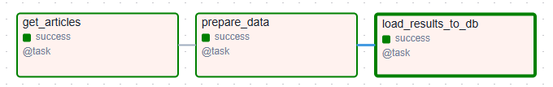

# Analysis of news articles
Weekly automated ETL pipeline in Airflow that collects and processes news articles, stores structured data in PostgreSQL, and provides analytics-ready datasets in MinIO.

ETL-pipeline implementation orchestrated by Airflow. <u>Fundamentals of Data Engineering</u>

This project is refined and adapted to <u>Airflow</u> "news-article-analysis" project

## Task
Collect, process, and save data from news sites to analyze the most popular topics.
 
The ETL process should be performed once a week to ensure fresh data.

## ETL-pipeline
The DAG graph is shown in the image below



1) **Extract. get_articles**
    - Using the API of the news aggregator;
    - Uploading articles on the specified topics (for example, "technology", "science", "apple").
2) **Transform. prepare_data**
    - Text preprocessing (stop words, extra characters);
    - Sentiment analysis;
    - Identifying the main topics (TF-IDF).
3) **Load. load_results_to_db**
    - PostgreSQL: SQLAlchemy hooks
    - MinIO: S3Hook integration
        - Parquet for analytics
        - CSV for raw backups

## Technologies used

- Apache Airflow
- SQLAlchemy (PostgreSQL)
- alembic
- MinIO
- requests
- pandas, nltk
- pydantic
- parquet

## Project Structure
```
airflow-project/
├── dags/                       # Main DAG definitions
│   └── news_article_dag.py     # Primary pipeline
├── db/                         # table initialization and data schema versioning
│   ├── migrations/             # alembic migrations
│   └── models/                 # table models
├── etl/                        # Core business logic
│   ├── extract/                # data retrieval
│   ├── transform/              # NLP processing
│   └── load/                   # DB/MinIO utils
├── plugins/
│   ├── io/                     # dataframe ⇄ bytes
│   └── s3_client/              # Custom operators/hooks
└── config/                     # Environment configs
```

## Run
...


./db folder for db table initialization and for data schema versioning. In real-world projects, DB migrations would typically be in a separate repository, but here they are colocated with Airflow for educational purposes.